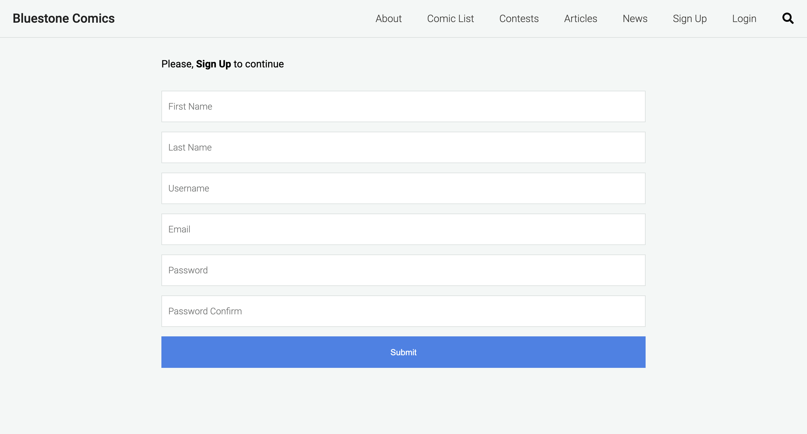

# Bluestone Comics

  ## Description
  Allows users to upload their own comic books and displays credits to other users who contributed to an uploaded work. This project is still a work in progress. The technologies used were: React, Express, Node, and PGSQL.

  ## Table of Contents

  * [Installation](#installation)

  * [Usage](#usage)

  * [Visuals](#visuals)

  * [Contributing](#contributing)

  * [Deployed Links](#deployed-links)

  * [Questions](#questions)


  ## Installation

  To install necessary dependencies, run the following command in the client and server:

  ```
  npm i
  ```

  ## Usage

  In order to run this project locally, you will have to contact me to provide the files: ```dev.js``` and ```config.env```. Otherwise, this project will not run locally.

  To start the server and client, run ```npm run dev```

  To start the server, run ```npm run server```

  To start the client, run ```npm run client```

  ## Visuals
  


  ## Contributing

  Send me an email if you are interested in contributing (contact info listed below).

  ## Deployed Links

* [The URL of the deployed application.](https://calm-beach-85667.herokuapp.com/)

* [The URL of the GitHub repository.](https://github.com/simone188535/bluestone-comics)

  ## Questions

  If you have any questions about the repo, open
  an issue or contact me directly at simone.anthony1@yahoo.com. You
  can find more of me at [simone188535](https://github.com/simone188535)
